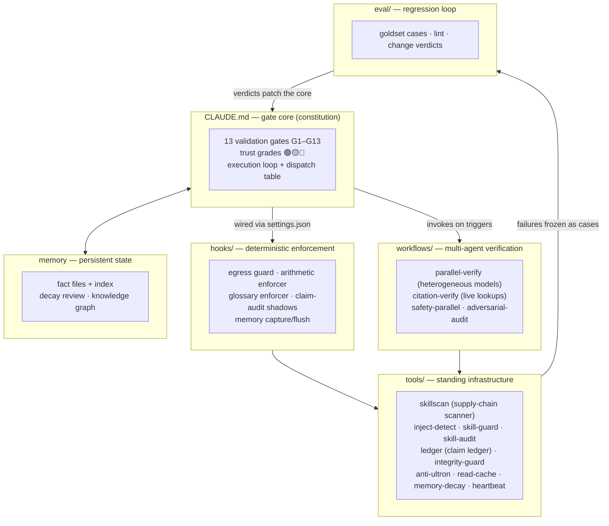

# verification-harness

A verification-first Claude Code harness, built and battle-tested by a mechanical design engineer.

In engineering work, a hallucinated part number, a fabricated DOI, or a silently wrong stress calculation is not a cosmetic bug — it propagates into drawings, BOMs, and purchase orders. This repo is the harness I built around Claude Code so that **every numeric claim, citation, and causal argument gets graded, checked, or blocked before it reaches me.**

Most of the documents are in Korean (my working language). The structure, code, and this README are what matter for reuse — the ideas port to any language.

> This is a curated snapshot of a live setup, not a turnkey product. Read it as a **reference architecture**: steal the pieces, not the whole.

## Core ideas

1. **Gates, not vibes.** Before any answer ships, it passes 13 named validation gates (G1–G13) defined in [CLAUDE.md](CLAUDE.md): fabrication hard-block (G4), arithmetic re-execution (G9), prompt-injection isolation (G11), execution-claim audit (G12), recurrence prevention (G13), and so on. A gate failure blocks output; it doesn't get a footnote.
2. **Trust grades on everything load-bearing.** Every number, standard, citation, and causal claim carries 🟢 (directly sourced from a tool/standard/URL) / 🟡 (industry practice or memory) / 🔴 (guess). Memory-based citations cap at 🟡 — only live tool output earns 🟢. Epistemic grade, human approval, and action authorization are three separate axes that must never be conflated.
3. **Heterogeneous cross-verification.** Safety-critical or contested conclusions get re-derived by *different model families* (Gemini, Groq/Llama, OpenAI via CLI, local models) through orchestrated workflows — because a model rechecking itself shares its own blind spots.
4. **The supply chain is an attack surface.** Skills, plugins, and even CLAUDE.md itself are treated as untrusted input. Anything external passes an INTAKE pipeline: quarantine → static IOC scan (`skillscan`) → human full-read → rebuild-or-excerpt → promote with provenance. Natural-language instructions are treated as the same threat class as code.
5. **Shadow first, enforce later.** New checkers run in shadow mode (observe and log, block nothing) until false-positive rates are measured. Several hooks in this repo are permanent shadows feeding an eval loop.
6. **Humans own the gates that matter.** Scanners warn, ledgers record, models vote — but promotion, deletion, and safety-critical judgment stay behind an explicit human decision.
7. **Failures become regression tests.** When a gate misses something real, the case is frozen into a goldset (`eval/`) so the same failure can never return silently (G13).

## Architecture

The loop at the bottom is the point: **gate failures become eval cases, eval verdicts patch the constitution.** The harness version number in CLAUDE.md (v5.6.9 at snapshot time) is the changelog of that loop running for months.

## What's in here

| Path | What it is |
|------|-----------|
| [CLAUDE.md](CLAUDE.md) | The gate core. Absolute gates, execution loop, model routing, dispatch table, output contract. Start here. |
| [GLOSSARY.md](GLOSSARY.md) | Plain-language glossary; a hook forces internal jargon to be translated before output. |
| [settings.example.json](settings.example.json) | How every hook plugs into the Claude Code lifecycle (PreToolUse / PostToolUse / SessionStart / Stop …). |
| [hooks/](hooks/) | Deterministic Python hooks: egress blocking (secret + network patterns), arithmetic-verification nudges, glossary enforcement on Stop, claim-audit shadows, memory flush gates. |
| [tools/skillscan/](tools/skillscan/) | Static scanner + INTAKE pipeline for external skills/plugins (quarantine → scan → human gate → promote with provenance ledger). |
| [tools/inject-detect/](tools/inject-detect/) | Two-layer prompt-injection detector (regex + local LLM) used as an INTAKE stage. |
| [tools/skill-guard/](tools/skill-guard/) | Maliciousness classifier scaffold (LoRA fine-tune; weights not included). |
| [tools/skill-audit/](tools/skill-audit/) | Two-track auditor: safety (malice) + substance (hollow-skill detection), with a weekly self-improvement loop. |
| [tools/ledger/](tools/ledger/) | Claim ledger: verified claims stored as `{Claim–Evidence–Verdict}` records with O(1) contradiction checks and a 3-tier re-verification skip rule. |
| [tools/integrity-guard/](tools/integrity-guard/) | File-fingerprint drift watcher for the harness itself (warn-only). |
| [tools/anti-ultron/](tools/anti-ultron/) | Egress redaction + guard + trajectory logging for outbound content. |
| [tools/read-cache/](tools/read-cache/), [tools/memory-decay/](tools/memory-decay/), [tools/memory-compile/](tools/memory-compile/), [tools/heartbeat/](tools/heartbeat/) | Token savers and maintenance loops: re-read blocking, memory decay review (human-gated), scheduled-job health checks. |
| [workflows/](workflows/) | Claude Code Workflow scripts: `parallel-verify.js` (Gemini + Groq + optional extra CLI slots, vote + convergence), `citation-verify.js` (deterministic DOI/arXiv API lookups, agent lookups for the rest), `safety-parallel.js`, `adversarial-harness-audit.js` (3-role attack loop against the harness itself). |
| [skills/](skills/) | Self-authored skills. Verification family: `gemini-review`, `groq-review`, `agy`, `cdx`, `fact-audit`, `pn-verify`, `citation`-adjacent `spec-lint`, `skill-audit`, `intake`. Mechanical family: `vdi2230` (bolted joints), `reliability` (fatigue/vibration/sealing), `dfm-bom-dr` (manufacturability/config management), `solidworks-addin`, `stp-analyzer`. Utilities: `pdf-ko`, `video-analyze`, `site-extract`, `prompt-compress`, `img-gen`, `ghostfont-crack`. |
| [agents/](agents/) | Subagent definitions (e.g. `research-scout`, a collect-only web scout with judgment explicitly out of scope). |
| [eval/](eval/) | Regression frame: goldset case format (`g13_case.py`), harness lint, numeric change-verdict criteria, gate stress cases (`tests/harness_cases.yaml`). |
| [scripts/](scripts/) | Citation lookup utilities (Crossref/arXiv with deterministic fallback order) and the memory-graph refresh script. |

## How a turn actually flows

A representative safety-relevant question ("is this bolted joint safe?") moves through:

1. **Dispatch** (CLAUDE.md L2): keyword triggers load the `vdi2230` skill; the turn is classified as a design judgment, so it stays on the main model with full gates — no delegation.
2. **Goal declaration** (L1): one line stating the pass/fail criterion before reasoning starts.
3. **Arithmetic** (G9): preload/torque math is executed in Bash or back-calculated, intermediate values and units exposed.
4. **Assumptions** (G8): each load-bearing assumption is tested now if testable, or flagged as RISK with a threshold and sensitivity direction.
5. **Cross-verification** (G6): safety-critical conclusion → `safety-parallel.js` re-derives it with heterogeneous models and reports convergence or forced `cross_verified:false`.
6. **Ledger** (G13): the verified claims are written as Claim–Evidence–Verdict records; future contradicting statements get caught mechanically.
7. **Output contract** (L5): conclusion first, grades attached, verification log separated at the bottom, jargon translated per glossary — enforced by a Stop hook, not by good intentions.

## What was deliberately removed

So you know what you're *not* looking at:

- **Personal memory, session logs, telemetry** — all of it.
- **The domain-expert skill layer** — my day-job domain skills were stripped; the dispatch table in CLAUDE.md marks the extension point where your own domain rows plug in. The five mechanical skills included are representative of the pattern.
- **Third-party skills** (Cloudflare's, Emil Kowalski's design skills, extracted OSS like GEPA) — not mine to republish. The INTAKE provenance ledger is how they entered the live system.
- **Model weights** (skill-guard LoRA adapter) and bundled runtimes — code and prompts remain.
- **Personal infra** (NAS sync, phone wake scripts, notification topics, API key helpers) — paths and topics replaced with placeholders; `~/.claude/scripts/ntfy.sh` referenced by some tools is a 2-line `curl -d "$1" ntfy.sh/$TOPIC` wrapper you can recreate.
- **Persona/tone layer** — the live CLAUDE.md carries a personal speaking-style contract; only the structural note remains.

## Caveats

- Built for **macOS** (launchd schedules, `sed -i ''`, keychain assumptions). Linux ports need small edits.
- Several tools shell out to CLIs you may not have (`agy`, `cdx`, `ollama`, `gh`) or expect API keys in env vars (`GEMINI_API_KEYS`, `GROQ_API_KEY`). Everything degrades to warnings, but read before wiring.
- Paths assume the repo contents live under `~/.claude/` (hooks reference `~/.claude/hooks/...` etc.). `settings.example.json` shows the wiring.
- This is a **snapshot**; the live harness keeps moving. Version history and the reasoning behind each patch live in the Korean-language docs.

## License

MIT — see [LICENSE](LICENSE).
